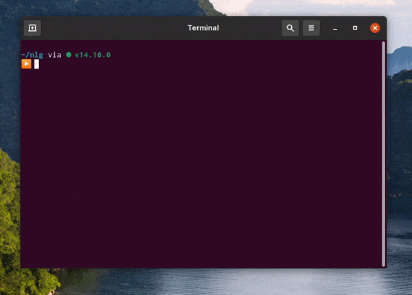

## Basic Functions
### Alert:
```
Linux(*Pizza*)
```

### Declare (and modify) a variable:
```
Arch(*name*,*value*)
```
```
Arch(*type*,*Pepperoni*)
```

### While:
```
Debian(expression#number-of-lines-from-current)
```
```
Debian(*<|customerpaid|>*=/*true*#1)
Linux(*PAY!!*)
```
**Note:**  
`*val1*=*val2*` = `'val1' == 'val2'`  
`*val1*=/*val2*` = `'val1' != 'val2'`  
`*val1*<~*val2*` = `'val1' < 'val2'`  

### If:
```
Elementary(expression#number-of-lines-to-skip-if-false)
```
```
Elementary(*<|type|>*=*Pepperoni*#1)
Linux(*That would be $5*)
```

### console.log:
```
Fedora(*string*)
```
```
Fedora(*Welcome!*)
```

### Loop:
```
Pop!_OS(number-of-occurences#number-of-lines-from-current)
```
```
Pop!_OS(10#1)
Fedora(*🍕*)
```

### (Multi-Line) Comment:
```
RedHat(number-of-lines-since-current)
```
```
RedHat(1)
this text will be ignored
this text will not be ignored
```
___
### Almost all strings are parsed in nothinglang, so you can do these:
```
RedHat(1)
Use a variable
Arch(*what*,*hello internet*)
Fedora(*<|what|>*)

RedHat(1)
Do window.prompt()
Arch(*what*,*<!prompt some custom text here!>*)
Arch(*what*,*<!prompt What is your name?!>*)

RedHat(1)
Do window.confirm()
Arch(*what*,*<!confirm some custom text here!>*)
Arch(*what*,*<!confirm 1 pepperoni pizza?!>*)

RedHat(1)
Evaluate math expression (thanks to expr-eval!)
Arch(*what*,*<!math some math expression here!>*)
Arch(*what*,*<!math 1+1+1+1!>*)

RedHat(1)
Encode Base64
Arch(*what*,*<!deepin.enc string!>*)
Arch(*what*,*<!deepin.enc lolllllll!>*)

RedHat(1)
Decode Base64
Arch(*what*,*<!deepin.dec base64!>*)
Arch(*what*,*<!deepin.dec bG9sbGxsbGxs!>*)
```

___
## Deno-version-only Functions
  

___  
To run your code, open up a terminal and use this command (make sure [Deno](https://deno.land) is installed)
```shell
deno run --allow-read https://raw.githubusercontent.com/liimee/nothinglang/nothinglang/deno.js filename.nothing
```
The `--allow-read` flag is necessary.  

___
### Read files
```
Arch(*file*,*<!opensuse filename.fileext!>*)
Arch(*file*,*<!opensuse thingy.txt!>*)
```
(files will be treated as UTF-8)  

### Write files (edit if file exist, create if not)
```
RaspberryPiOS(*filename*,*contents*)
RaspberryPiOS(*thingy.txt*,*🐧🦕*)
```
### Edit files
```
Manjaro(*filename*,*newcontent*)
Manjaro(*thingy.txt*,*😛*)
```
### Delete file/folder
```
Ubuntu(*filename*)
Ubuntu(*thingy.txt*)
```

### Create a new folder
```
ZorinOS(*dirname*)
ZorinOS(*Collections*)
```

___
## Functions that requires the `--allow-write` flag (see [this](https://deno.land/manual/getting_started/permissions#permissions-list))
- `RaspberryPiOS`
- `Manjaro`
- `Ubuntu`
- `ZorinOS`
